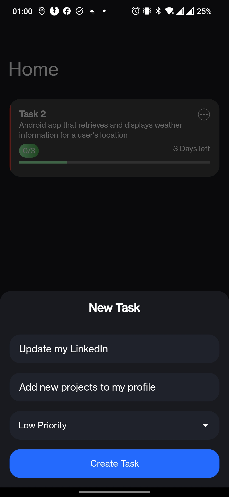

  

<h1 align="center">Task manager App</h1>
 task management Android application. The app allow users to create, edit, and manage tasks and
to-do lists. 

## Features

- task prioritization
- due dates
- Notification
- Data Storage

## Details

Todo is a basic task manager/todo list built for Android. It is built using Kotlin, MVVM / Clean Architecture, Fragments. The interface is built with Material 3 and uses the system preference to determine light/dark mode.

## Screenshots

     &emsp;
     &emsp;

  

## References

[Android Architecture Documentation](https://developer.android.com/topic/architecture)

[Material Design Components](https://m3.material.io/components)

[Material Design Theme Builder](https://m3.material.io/theme-builder)
